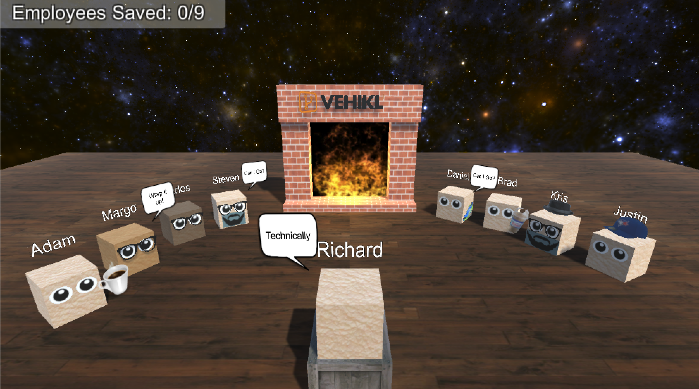

## Vehikl's Fire Side Tech Talk&trade; - The Game&reg;

made with Unity 5.6.0f3 https://store.unity.com/download?ref=personal

**Download** | [Windows](https://github.com/ssshake/fire-side-tech-chat-the-game/raw/master/Binaries/Windows/FSTTTG_win.zip) | [OSX](https://github.com/ssshake/fire-side-tech-chat-the-game/raw/master/Binaries/OSX/fire-side-tech-talk-the-game_osx.zip) |

# The Story

Fire Side Tech Talk&trade; - The Game&reg;, is a game about me giving a fire side tech talk about game development. In this game, everyone is painfully bored of the content of my talk and they have the choice to either endure the rest of the talk which will continue for eternity or to save themselves by jumping into the Fire Side Tech Talk's&trade; fire place.
